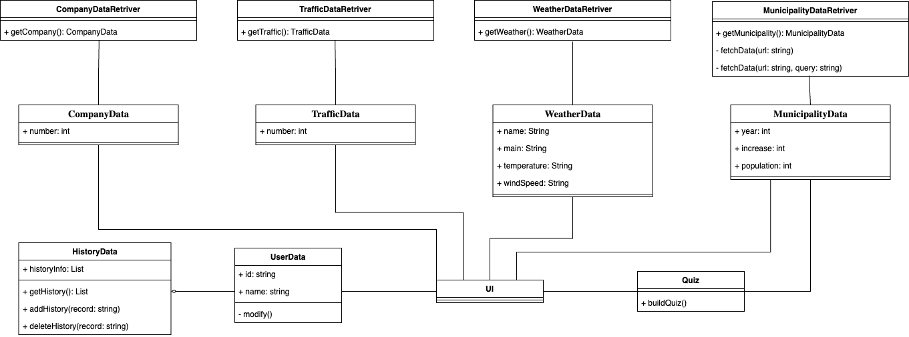

# README

### General description of the work

This is an android app about Finnish cities. Users can use the app to view some information about Finnish cities, such as weather conditions, population, etc. Additionally, the user can take a quiz related to the city to see his/her familiarity with the city. When users search for a city, they can view some recent historical information to facilitate quick retrieval. User's personal information is also recorded and it's editable.

We use various APIs to obtain this information and display it to users in a more beautiful way. Some common but effective features of Android such as fragment and recyclerview is used appropriately to bring a more elegant programming structure and an easier-to-use interface. Besides, we utilize file operations in our app to persistent some data such as user infomation and history information.

### Installation instructions

For our app, you just open source code in Android Studio (make sure it is a version of Iguana), wait for gradle syncing done, and start.

And make sure you can connect Internet so that you can fetch data from API.

### Class diagram

### Division of labour between team members

* Qi Zhou: User page, Search page, part of Information page(including municipality data fetching and showing)
* Xiuzhu Li: Quiz page, part of Information page(including company data, traffic data, weather data fetching and showing)

### Features that were implemented

| **Requirement**                                   | **Description**                                                                                                                                                                                                      | **Points we may get** |
| ------------------------------------------------------- | -------------------------------------------------------------------------------------------------------------------------------------------------------------------------------------------------------------------------- | --------------------------- |
| Object-oriented code                                    | ✅ App is coded according to object-oriented paradigm.                                                                                                                                                                     | Mandatory                   |
| Code, comments and related documentation are in English | ✅ Application code, comments and documentation are in English.                                                                                                                                                            | Mandatory                   |
| App works in Android                                    | ✅ Application works in Android devices, and it is coded in Android Studio.                                                                                                                                                | Mandatory                   |
| Application includes basic functionality                | ✅ App covers all the functionality defined earlier in this document.                                                                                                                                                      | Mandatory                   |
| Documentation                                           | ✅ Include all things needed.                                                                                                                                                                                              | Mandatory                   |
| You are fetching data via API                           | ✅ Use the Statistics Finland API ([https://pxdata.stat.fi/PxWeb/pxweb/en/StatFin/](https://pxdata.stat.fi/PxWeb/pxweb/en/StatFin/)).                                                                                         | Mandatory                   |
| RecycleView                                             | ✅ Use RecycleView component in listing data such as history, right answers.                                                                                                                                              | 3                           |
| You are displaying images                               | ✅ Different icons are shown in different weather condition.                                                                                                                                                               | 2                           |
| There is more than one data source                      | ✅ Another API and it’s displayed to the user: [https://openweathermap.org/api/geocoding-api](https://openweathermap.org/api/geocoding-api) [https://openweathermap.org/current](https://openweathermap.org/current) | 3                           |
| There are more than two data sources                    | ✅ A third API and it’s displayed to the user: [https://trafi2.stat.fi/PXWeb/pxweb/en/TraFi/](https://trafi2.stat.fi/PXWeb/pxweb/en/TraFi/)                                                                            | 2                           |
| There are more than three data sources                  | ✅ A fourth API and it’s displayed to the user: [https://avoindata.prh.fi/tr_en.html](https://avoindata.prh.fi/tr_en.html)                                                                                             | 1                           |
| Statistics                                              | ✅ Record user searching history data, it is shown to user and can be select.                                                                                                                                              | 2                           |
| Comparing municipalities                                | ❌                                                                                                                                                                                                                         | 0                           |
| Quiz                                                    | ✅ The app will generate ten questions about the data in municipality with true/false options. In the end user is shown the final score and how well they did in the quiz.                                           | 4                           |
| Fragments                                               | ✅ Use Fragment (reusable UI components) in our work.                                                                                                                                                                     | 4                           |
| Data visualization                                      | ❌                                                                                                                                                                                                                         | 0                           |
| Game                                                    | ❌                                                                                                                                                                                                                         | 0                           |
| Feature X                                               | ✅ Persistent useful data such as history data and user data in local file. File operations are used to read and write data. This will make sure data is recorded even if you close our app and reopen it.       | 2                           |
